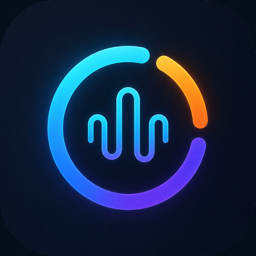
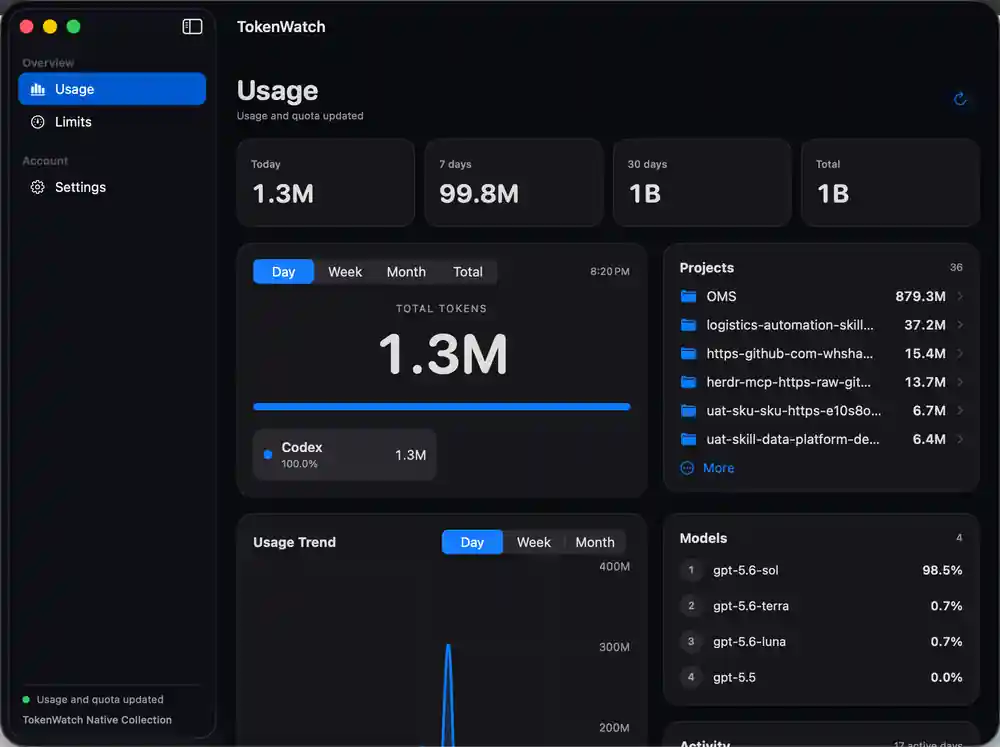
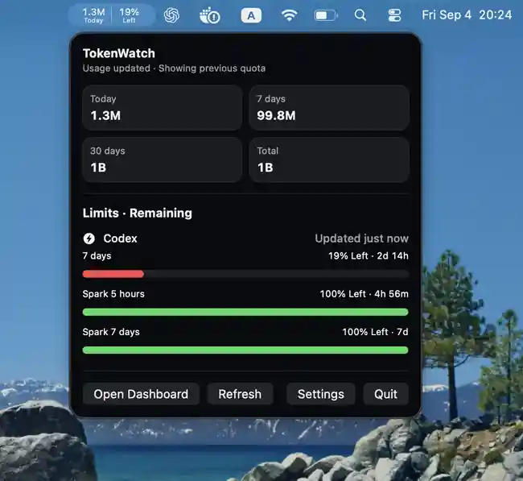

<div align="center">
  
  <h1>TokenWatch Mac</h1>
  <p><strong>Native Swift. ~5.3 MB Universal DMG. Near-zero idle CPU. Built to stay open.</strong></p>
  <p>Codex · Claude Code · Antigravity · OpenCode</p>
</div>

<p align="center">
  <a href="README.md">English</a> ·
  <a href="README.zh-CN.md">简体中文</a> ·
  <a href="README.zh-TW.md">繁體中文</a> ·
  <a href="README.ja.md">日本語</a> ·
  <a href="README.ko.md">한국어</a> ·
  <a href="README.fr.md">Français</a> ·
  <a href="README.es.md">Español</a>
</p>

## What it does

TokenWatch Mac is a native menu-bar application that reads the standard local data stores of supported AI clients in **read-only** mode, normalizes token usage and quota information, and presents it in a compact dashboard.

- Automatically discovers supported local AI clients.
- Tracks today, 7-day, 30-day and recorded-all-time token usage.
- Shows provider and model breakdowns, project trends and quota windows.
- Supports authenticated LAN sync and end-to-end encrypted CloudKit mailbox sync for companion clients when the entitlement-enabled build is used.
- Does not store prompts, responses, tool arguments, complete project paths or provider credentials in TokenWatch snapshots.

## Designed for continuous operation

TokenWatch Mac is optimized for long-running menu-bar use with low collection overhead.

- **Incremental Codex indexing** reads only newly appended bytes after the initial index is built.
- **FSEvents-driven refresh** reacts to changes in approved provider directories, with periodic refresh retained as a fallback.
- **Bounded concurrency** limits simultaneous large collectors.
- **Semantic snapshot deduplication** avoids unnecessary disk, LAN and CloudKit writes when data has not meaningfully changed.
- **Latest-wins remote sync** prevents obsolete snapshots from building an upload backlog.
- Native Swift / SwiftUI implementation with no embedded browser runtime or always-on local web server.

### Reference collection performance

Reference benchmark using approximately **810 MB of Codex history**:

| Scenario | Before optimization | Current |
| --- | ---: | ---: |
| Full cold collection | 10.10 s / ~232 MiB peak | **3.23 s / ~127 MiB peak** |
| New Codex data with existing index | full rescan | **0.86 s / ~34 MiB peak** |
| Immediate no-change collection | full rescan | **0.82 s / ~34 MiB peak** |

These figures measure the collection/export path rather than steady-state application RSS. Results vary with log volume, storage and hardware.

## Small by construction

TokenWatch Mac is a **native Swift / SwiftUI / AppKit** application. The current Universal build uses macOS system frameworks directly and ships with **no embedded Frameworks directory, no Chromium, no Electron and no Node.js runtime**.

Measured from the current public Release build on 2026-09-05:

| Metric | Measured value |
| --- | ---: |
| Universal DMG (arm64 + x86_64) | **5.3 MB** |
| Installed `.app` bundle | **~11 MB** |
| Main executable | **~8.0 MB** |
| Embedded runtime frameworks | **0** |
| Persistent child processes while idle | **0** |
| Idle `top` MEM after ~1.5 h runtime | **~45 MB** |
| Idle `ps` RSS | **~121 MiB** |
| 6 consecutive 1 s idle samples | **0.0% CPU / 0.0 POWER** |

`top` MEM and `ps` RSS are intentionally both shown because macOS memory tools use different accounting. RSS includes shared mappings and should not be read as "private memory." `POWER 0.0` is macOS `top`'s relative process power metric, **not a watt measurement**. Longer sampling also catches short refresh bursts; the process returns to idle immediately afterward.

### What that means on a current Mac

As of **2026-09-05**, Apple's current M6 Mac mini configurator prices an adjacent **8 GB unified-memory step at $200** and the **256 GB → 512 GB SSD step at $200**. The M6 Mac mini itself starts at **$899** in the U.S.

Using those upgrade steps only as a playful **capacity-equivalent illustration**:

- ~45 MB idle `top` memory is about **0.19% of 24 GB**, or roughly **$1.1** of capacity at a $25/GB memory-upgrade rate.
- The ~11 MB installed app is about **0.004% of 256 GB**, or roughly **$0.01** of capacity at that SSD-upgrade rate.
- The 5.3 MB download is about **0.002% of 256 GB**, equivalent to **less than half a cent** at the same storage rate.

This is **not an accounting claim**: Apple upgrade prices are not the intrinsic manufacturing cost of RAM or SSD space. It is simply a way to make the scale intuitive.

### Why native Swift matters

A native implementation lets TokenWatch reuse the frameworks already shipped with macOS instead of bundling a browser runtime. For scale, Electron **v44.0.0** ships a macOS arm64 runtime ZIP of **129,743,965 bytes (~123.7 MiB)** before an application's own code and assets. TokenWatch's **5.3 MB Universal DMG** contains both Apple Silicon and Intel binaries and is still about **23× smaller than that compressed Electron runtime archive alone**.

Electron also documents a Chromium-derived multi-process model with a main process and renderer processes. TokenWatch currently has no persistent child process while idle. This is a **framework-baseline comparison, not a claim that every non-Swift app or every competing tracker is heavy**; several good native macOS trackers are also built with Swift.

Sources: [Apple M6 Mac mini announcement](https://www.apple.com/newsroom/2026/08/apple-unveils-a-more-powerful-mac-mini-featuring-the-all-new-m6-and-m5-pro/) · [Apple M6 Mac mini configurator](https://www.apple.com/shop/buy-mac/mac-mini/m6-chip-12-core-cpu-12-core-gpu-24gb-memory-256gb-storage) · [Electron v44.0.0 release](https://github.com/electron/electron/releases/tag/v44.0.0) · [Electron process model](https://www.electronjs.org/docs/latest/tutorial/process-model)

## Screenshots

<p align="center">
  
</p>
<p align="center"><sub>Dashboard with usage summaries, project breakdown, model distribution and usage trends.</sub></p>

<p align="center">
  
</p>
<p align="center"><sub>Menu-bar popover with rolling usage totals and quota windows.</sub></p>

## Privacy

- Only the Mac hub reads local AI-client logs.
- Provider credentials are not written to TokenWatch caches or cross-device snapshots.
- Codex, Claude Code and OpenCode use local token counters. Antigravity is labeled as an estimate because its local transcript data does not expose authoritative token counters.
- CloudKit stores only the latest end-to-end encrypted envelope in the user's private database.
- File discovery is restricted to known provider locations; TokenWatch does not recursively crawl the user's home directory.

## Install

Download the latest DMG from **GitHub Releases**.

Current DMG builds are Universal, ad-hoc signed and not notarized; macOS may display a Gatekeeper warning. CloudKit remote sync is available only in builds with the required entitlements.

## Build

Requirements: macOS 14+, Xcode and the Swift 6.1 toolchain.

```sh
Scripts/bootstrap
Scripts/verify
```

Build a local Universal ZIP:

```sh
Scripts/build-mac-local-release
```

Build a local Universal DMG:

```sh
Scripts/build-mac-dmg
```

Artifacts are written under `.artifacts/`.

## Source availability

The source is publicly visible for transparency and review. No open-source license is granted unless a license file explicitly states otherwise. All rights are reserved.
